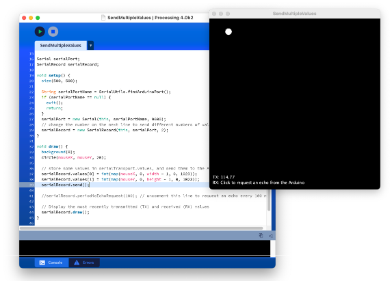
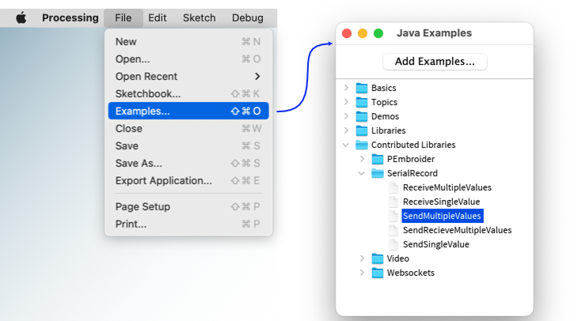

# Serial Record Library for Processing

A Processing library for sending and receiving multiple-value records on the
serial port.

The library transmits the values in ASCII. Each record is a sequence of ASCII
representations of numbers, separated by a comma and terminated by a newline.

This library can be used in conjunction with the [Arduino SerialRecord] library
for the Arduino, but does not require it.

[Arduino SerialRecord]: https://osteele.github.io/Arduino_SerialRecord/

## Design Goals

- Easy for novice programmers to configure and use
- Easy to inspect the transmitted data
- Detects and provides diagnostics for common errors

### Non-goals

- Efficiency. The library uses an ASCII representation of numbers. This is easy
  to visually inspect without tools, but it is computationally expensive to read
  and write, and requires more bandwidth than a binary representation.
- Flexibility. All records must have the same number of values; only integers
  are supported. The first limitation make it possible to detect errors in code
  that uses the library, but is not appropriate to all communications. If you
  need more flexibility, this is not the library for you.

## Installation

**Note**: This library requires [Processing 4](https://processing.org/download).
It does not support the Stable release, Processsing 3.5.4.

1. Download <https://assets.osteele.com.s3.amazonaws.com/processing/SerialRecord.zip>.
2. Uncompress the downloaded archive file, to create a folder "SerialRecord".
3. Move the SerialRecord folder into the folder Process/Libraries in your home directory.

The next time you start the Processing IDE, you will find examples from the "File > Examples" menu.

Note: Remember to make a copy of an example before you modify it: The Processing
IDE (unlike the Arduino IDE) will not do this for you.

## Examples

Once you install the library, these examples are available from the *File >
Examples* menu.

Each example is designed to pair with an example in the [Arduino SerialRecord]
library, but they can also be used with other sketches, or as a starting point
for your own work.

You can also review them
[on GitHub](https://github.com/osteele/Processing_SerialRecord/tree/main/examples).

## Features

- Transmitted and received lines can be displayed on the canvas (see the
  screenshot above), and/or logged to the console.
- Received records that have too few or too many values result in a warning
  in the console.
- When used with the [Arduino SerialRecord] library, sending a different number
  of values than the code running on the Arduino expects, results in a warning
  in the Processing console.
- When used with the [Arduino SerialRecord] library, a command can be used to
  request that the Arduino send back the values that it received, for debugging.
  This can be done once, or at periodic intervals.

## Acknowledgements

The idea of providing this code as a library was inspired by code
provided to students by the NYU Shanghai IMA "Interaction Lab" course, for them to copy and paste into their sketches.

## License

Copyright (C) 2020-2022 Oliver Steele. This software is made available under the
terms of the GNU LGPL License.
