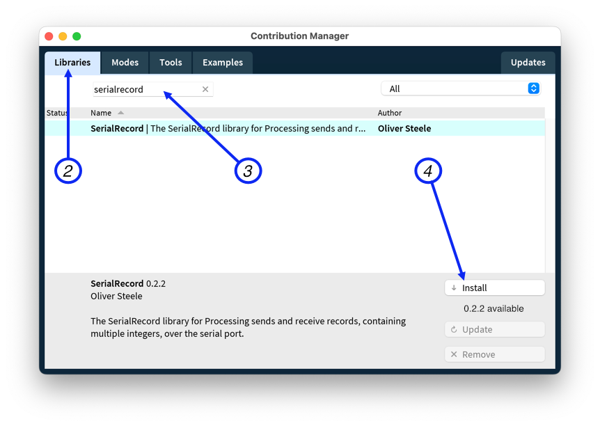

# Serial Record Library for Processing

The SerialRecord library for Processing sends and receive records, containing
multiple integers, over the serial port. It is intended for novice programmers:
it is designed to be easy to use, to detect when it is used incorrectly, and to
detect and report when it receives invalid data. It also has an option to
display the data sent to the and received from the serial port on the canvas.

Data is sent as comma-separated ASCII. This format is easy to view and interact
with in the Arduino Serial Monitor, and is compatible with the Arduino Serial
Plotter.

The Library can be used with the [SerialRecord library for Arduino], but does
not require it.

[SerialRecord library for Arduino]: https://osteele.github.io/Arduino_SerialRecord/

## Design Goals

- Easy for novice programmers to configure and use
- Easy to inspect the transmitted data
- Detects and provides diagnostics for common errors

### Non-goals

- Efficiency. The library uses an ASCII representation of numbers. This is easy
  to visually inspect without tools, but it is computationally expensive to read
  and write, and requires more bandwidth than a binary representation.
- Flexibility. All records must have the same number of values; only integers
  are supported. The first limitation make it possible to detect errors in code
  that uses the library, but is not appropriate to all communications. If you
  need more flexibility, this is not the library for you.

## Features

- Parses sequences of integers separated by comma (CSV), tab (TSV), or space.
- Can be configured to display the most recent sent and received data on the
  canvas (see the screenshot above).
- Can be configured to log send and receive data to the console.
- Received records that have too few or too many values result in a warning in
  the console. This can help detect issues such a mismatch between the number of
  values that the Arduino sketch sends, and the number that the Processing
  sketch expects to receive.
- When used with the [SerialRecord library for Arduino] library, sending a
  different number of values than the code running on the Arduino expects,
  results in a warning in the Processing console. This can help detect issues
  such a mismatch between the number of values that the Processing sketch sends,
  and the number that the Arduino expects to receive.
- Recognizes field names in records, e.g. `pot1:100,pot2:200`. This is the
  format recognized by the Arduino Serial Plotter.
- When used with the [SerialRecord library for Arduino] library, a command can
  be used to request that the Arduino send back the values that it received, for
  debugging. This can be done once, or at periodic intervals.

## Installation

Use Processing's *Contribution Manager* to install this library:

1. From the Processing IDE's *Tools* menu, select *Manage Tools…*.
   
2. Select the *Libraries* tab.
3. Search for "serialrecord".
4. Click *Install*.

Note: Remember to make a copy of an example before you modify it. The Processing
IDE (unlike the Arduino IDE) will not do this for you.

## Examples

Once you install the library, examples are available from the *File > Examples*
menu.

Each example is designed to pair with an example in the [SerialRecord library
for Arduino] library, but they can also be used with other sketches, or as a
starting point for your own work.

You may also review the examples [on
GitHub](https://github.com/osteele/Processing_SerialRecord/tree/main/examples).

## Alternatives

It is relatively easy to transmit data between the Arduino and Processing without a library.

- [Firmata](https://github.com/firmata/arduino), which features declarative
  binding of value positions to sensors or pin numbers.
- [VSync Library](http://ernestum.github.io/VSync/) for the Arduino platform
  "magically" synchronizes Arduino and Processing variables.

## Acknowledgements

The idea of providing this code as a library was inspired by code provided to
students by the NYU Shanghai IMA "Interaction Lab" course, for them to copy and
paste into their sketches.

## License

Copyright (C) 2020-2022 Oliver Steele. This software is made available under the
terms of the GNU LGPL License.
